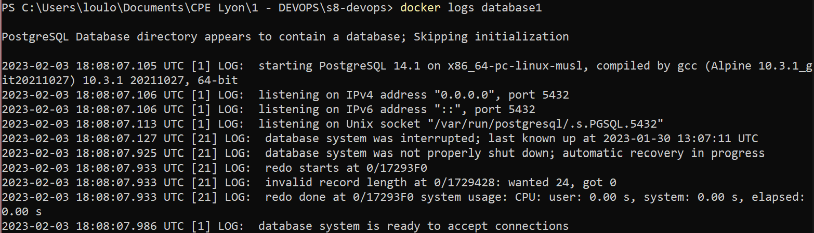

# TP1 - DOCKER

<div style="font-size:13px; font-weight:700; color:#C4C4C4; margin-bottom:30px">Louisa Chaduc - 30.01.2023</div>

## <span style="color:#D86D6F"> 0 - Initialisation </span>

Commandes réalisées pour ajouter les images préconfigurées utiles à notre application, avec les versions appropriées :

```bash
docker pull httpd:2.4             # HTTP server
docker pull openjdk:17            # Backend API
docker pull postgres:14.1-alpine  # Database
```

De plus, je crée les trois dossiers nécessaires à chaque image de mon application 3-tier :

```
s8-devops
├─ api
├─ http
└─ database
```

## <span style="color:#D86D6F"> 1 - Database </span>

<div style="border: 1px solid #AB1B1B; padding: 8px; background: #FBEFF2; font-weight:300; margin-bottom:20px">
<span style="font-weight:400">Question 1-1 :</span>
Documenter les commandes et le Dockerfile nécessaires à notre container Database.
</div>

La première étape est de créer le fichier de configuration <span style="color:#2D9469">`Dockerfile`</span> dans le dossier de la Database et l'initialiser.

```yaml
# Utilisation de l'image préconfigurée pour PostgreSQl
# Version alpine = version allegée
FROM postgres:14.1-alpine

# Variables d'environnement utiles à la connexion à la BD
# On ne place pas le mot de passe ici pour des questions de sécurité
# Il ne faut jamais que de telles données sensibles soient présentes en dur dans notre code source
ENV POSTGRES_DB=db \
POSTGRES_USER=usr

# Copie des scripts d'initialisation de la BD dans la configuration de l'image
COPY CreateScheme.sql /docker-entrypoint-initdb.d
COPY InsertData.sql /docker-entrypoint-initdb.d
```

Après cette configuration, voici les étapes à réaliser pour **monter notre environnement** :

- Build de l'image custo de la database :  
  <span style="color:#2D9469">`docker build -t youreastonefox/database .`</span>

- Création du network :  
  <span style="color:#2D9469">`docker network create app-network`</span>

- Création du volume :  
  <span style="color:#2D9469">`docker volume create dbvolume`</span>  
  Le volume nous permet de garder en mémoire les modifications appliquées à la BD, même après le redémarrage du container.

- Import de l'image de l'adminer, notre client SQL qui permet d'accéder à la database :  
  <span style="color:#2D9469">`docker pull adminer`</span>

- Exécution du container de la database et de l'adminer :  
  <span style="color:#2D9469">`docker run --name=database --net=app-network -e POSTGRES_PASSWORD=pwd -d -v dbvolume:/var/lib/postgresql/data youreastonefox/database`</span>  
  <span style="color:#2D9469">`docker run -p "8090:8080" --name=adminer --net=app-network -d adminer`</span>

<div style="background: #FBEFF2; padding: 10px 16px; margin: 10px; border-radius: 10px">
Description des paramètres ajoutés :  
<ul style="margin-bottom: 0px"> 
<li>--name : Définition du nom du container.</li> 
<li>--net : Définition du réseau du container, permet dans ce cas à admniner et database de communiquer.</li> 
<li>-e : Définition de variables d'environnement utilisées à l'exécution de l'image du container, dans notre cas le mot de passe de la DB (soucis de sécurité précisé précedemment).</li> 
<li>-d : Exécuter le container en arrière plan.</li> 
<li>-v : Définir le volume associé au container.</li> 
<li>-p : Mapping des ports pour exposer le container.</li> 
</ul>
</div>

**Connexion à la BD depuis l'adresse http://localhost:8090 :**


## <span style="color:#D86D6F"> 2 - API </span>

<div style="border: 1px solid #AB1B1B; padding: 8px; background: #FBEFF2; font-weight:300; margin-bottom:20px">
<span style="font-weight:400">Question 1-2 :</span>
Documenter les commandes et le Dockerfile nécessaires à notre container API et expliquer l'intérêt du Multistage.
</div>

### Création d'une base d'API

- Initialisation du Dockerfile dedié à cette tâche :

```yaml
# Import de l'image préconfiguré pour utiliser Javascript
# Choix de la version 17 car compatible à ma version de Java en locale et nécessaire pour la suite du TP
FROM openjdk:17

# Ajout du fichier Java compilé que l'on veut exécuter dans notre container
COPY Main.class .

# Exécution de la commande `Java Main`
CMD ["java", "Main"]
```

- Import de l'image de l'openjdk version 17 :  
  <span style="color:#2D9469">`docker pull openjdk:17`</span>

- Build de l'image custo de l'api :  
  <span style="color:#2D9469">`docker build -t youreastonefox/api .`</span>

- Exécution du container api :  
  <span style="color:#2D9469">`docker run --name=api --net=app-network -d youreastonefox/api`</span>

**Résultat en console :**


### Multistage

Après avoir généré mon projet Springboot et ajouté mon GreetingController, je fais évoluer mon Dockerfile pour utiliser le build en Multistage :

```yaml
# BUILD

# Utilisation de l'image préconfigurée de Maven (besoin pour Springboot)
FROM maven:3.8.6-amazoncorretto-17 AS myapp-build
# Variable d'environnement de la base de mon App
ENV MYAPP_HOME /
# Définition du Working Directory avec ma variable
WORKDIR $MYAPP_HOME
# Copie des fichiers de configuration du projet dans le Docker
COPY pom.xml .
COPY src ./src
# Exécution du package Maven
RUN mvn package -DskipTests

# RUN

# Utilisation de l'image préconfigurée de l'OpenJDK pour Amazon
FROM amazoncorretto:17
ENV MYAPP_HOME /
WORKDIR $MYAPP_HOME
COPY --from=myapp-build $MYAPP_HOME/target/*.jar $MYAPP_HOME/myapp.jar

# Définition du point d'entrée de l'API
ENTRYPOINT java -jar myapp.jar
```

<div style="background: #FBEFF2; padding: 10px 16px; margin: 10px; border-radius: 10px">
Dnas un premier temps, on utilise le Mulstistaging pour séparer les tâches  
</div>

À ce niveau là, on met à jour le contenu de notre application avec le code source de simple-api-student-main et on effectue le parcours suivant pour arriver à l'accès de notre API en ligne sur http://localhost :

- Edition de <span style="color:#2D9469">`application.yml`</span> pour connecter la BD :

```yaml
datasource:
  url: jdbc:postgresql://database:5432/db
  username: usr
  password: pwd
```

- Import de maven :
  <span style="color:#2D9469">`docker pull maven:3.8.6-amazoncorretto-17`</span>

- Build de l'image custo de l'api :
  <span style="color:#2D9469">`docker build -t youreastonefox/api .`</span>

- Exécution du container api :
  <span style="color:#2D9469">`docker run -p "8080:8080" --name=api -d youreastonefox/api`</span>


## <span style="color:#D86D6F"> 3 - HTTP Server </span>

Voici le Dockerfile nécessaire à lancer mon container :

```yaml
# Utilisation de l'image préconfigurée d'HTTPD version 2.4
FROM httpd:2.4

# Copy de la page web à exposer en configuration de l'image
COPY index.html /usr/local/apache2/htdocs/
# Copy du fichier de configuration qui sera utilisé au chargement de l'image pour pouvoir avoir u Reverse Proxy
COPY text.txt /usr/local/apache2/conf/httpd.conf
```

<div style="background: #FBEFF2; padding: 10px 16px; margin: 10px; border-radius: 10px">
Quelques commandes découvertes : 
<ul style="margin-bottom: 0px"> 
<li>docker stats : Permet d'avoir des infos en direct qur les container qui sont en train de tourner sur notre machine </li>
 
<li>docker inspect : Donne des informations détaillées sur un container sous forme de JSON.</li> 
<li>docker logs : Affiche les informations enregistrées par un conteneur en cours d'exécution.</li> 
 
<li>docker exec : Permet d'éxecuter une commande dans l'environnement d'un container. Exemple : docker exec e30 ls - Affiche les fichiers à la raciner du container d'identifiant e30...</li> 
 
</ul>
</div>

- Build de l'image custo du serveur :
  <span style="color:#2D9469">`docker build -t youreastonefox/httpdserver .`</span>

- Exécution du container httpd :
  <span style="color:#2D9469">`docker run --net=app-network --name httpdserver -p 80:80 -d youreastonefox/httpdserver`</span>

- Récupération de :
  <span style="color:#2D9469">`docker run --net=app-network --name httpdserver -p 80:80 -d youreastonefox/httpdserver`</span>
  docker exec e30 cat /usr/local/apache2/conf/httpd.conf : retourne le contenu de ce fichier de configuration

Le Reverse Proxy permet d’avoir un seul point d’entrée par l’exterieur sur notre application, et moins de ports sont ouverts plus notre application est sécurisée. Tout le flux httpd passe par un seul endroit (le container http) donc on peut gérer la sécurité à cet endroit seulement (whitelist et blacklist par exemple).  
Cela nous permettra également de faire du load balancing.  
Pour le configurer, on ajoute dans notre fichier de config httpd.conf le code suivant et on avctive les modules proxy_mod et prox_httpd_mod :

```
<VirtualHost \*:80>
ProxyPreserveHost On
ProxyPass / http://api:8080/
ProxyPassReverse / http://api:8080/
</VirtualHost>
```

## <span style="color:#D86D6F"> 4 - Docker Compose </span>

<div style="border: 1px solid #AB1B1B; padding: 8px; background: #FBEFF2; font-weight:300; margin-bottom:20px">
<span style="font-weight:400">Question 1-3 & 1-4 :</span>
Documenter les commandes principales et la configuration nécessaires à l'utilisation de docker-compose.
</div>

Docker compose nous permet d'automatiser tous les build et run de nos container, et lancer notre application en une ligne de commande : <span style="color:#2D9469">`docker compose up`</span>

Fichier de configuration :

```yaml
version: "3.7"

# Chaque service représenta la gestion d'un container
services:
  backend:
    # Lien vers le Dockerfile de notre container
    build: /api/simple-api-student-main/
    #  Nom du container
    container_name: api
    # Réseau sur lequel est publié le container
    networks:
      - app-network
    # Permet de lancer le build de ce container après la fin de celui de la BD
    depends_on:
      - database

  database:
    build: /database/
    container_name: database
    # Mapping du volume
    volumes:
      - dbvolume
    # Variable d'environnement du mot de passe de la BD
    environment:
      - POSTGRES_PASSWORD=pwd
    networks:
      - app-network

  httpd:
    build: /http/
    container_name: httpd
    # Mapping des ports
    ports:
      - "80:80"
    networks:
      - app-network
    depends_on:
      - backend

# Initialisation des réseaux utilisés dans notre config
networks:
  app-network:

# Pareil pour les volumes
volumes:
  dbvolume:
```


## Docker Hub

On utilise finalement Docker Hub pour publier nos images et les rendre ainsi accessible en ligne. Dans une entreprise, tous les développeurs ont ainsi accès à la même configuration Docker. De plus, on aura accès à de meilleures descriptions de nos images.

Il faut pour cela s'identifier : <span style="color:#2D9469">`docker login`</span>

Puis créer des tag de nos images :

```
docker tag tp1-backend youreastonefox/tp1-backend:1-0
docker tag tp1-httpd youreastonefox/tp1-httpd:1-0
docker tag tp1-database youreastonefox/tp1-database:1-0
```


Et enfin pousser nos images sur le Docker Hub :

```
docker push youreastonefox/tp1-backend:1-0
docker push youreastonefox/tp1-httpd:1-0
docker push youreastonefox/tp1-database:1-0
```


Visualisation de nos images en ligne :


