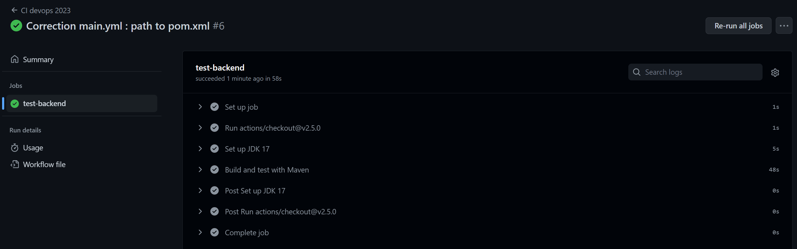
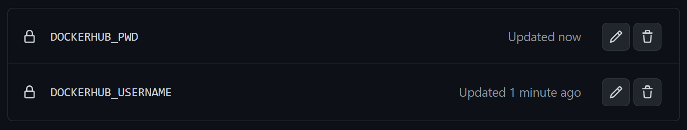
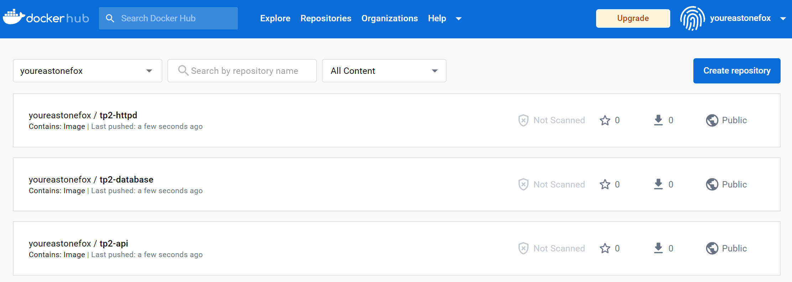
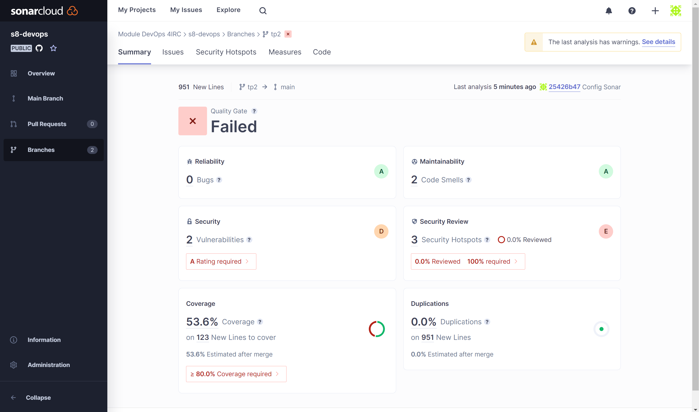

# TP2 - GITHUB ACTIONS

Alternatives à Github Actions : Jenkins, Gitlab CI, Bitbucket Pipelines.  
Les fichiers **YAML** décrivent les étapes qu'on veut voir s'exécuter le long de la pipeline.

`mvn clean verify` : Build et run les tests. Il faut la lancer depuis pom.xml ou ajouter l'argument `--file /path/to/pom.xml`.  
**À quoi sert cette commande ?**
Elle permet dans un premier temps de nettoyer (clear) les anciens builds encore présents dans le cache (sinon on pourrait être confrontés à des comportements inattendus car **MAVEN** ne reconstruit pas complètement l'application de A à Z), puis de rebuild complètement l'application et enfin d'exécuter les **tests unitaires et d'intégration** (aussi appelés **component tests**).

**Unit Test :** Procédure permettant de vérifier le bon fonctionnement d'une partie précise d'un logiciel ou d'une portion d'un programme.  
**Integration Test :** Phase de tests, précédée par les tests unitaires et généralement suivie par les tests de validation, où chacun des modules indépendants du logiciel est assemblé et testé dans l’ensemble.  
**Component Tests :** Aussi appelés "closed-box testing", ces tests évaluent le comportement du programme sans tenir compte des détails du code sous-jacent. Ils sont effectués sur la section de code dans son intégralité, une fois le développement terminé.

**Question 2-1 - Qu'est-ce que testcontainers?**

Dans cette portion de code, on voit que les testcontainers sont utilisées comme des dépendances. C'est une librairie Java qui permet d'effectuer différents types de tests : Elle utilise JUnit Tests, fournit des instances légères et jetables de bases de données communes, de navigateurs Web Selenium ou de tout autre élément pouvant s'exécuter dans un conteneur Docker.

Elle permet de rendre les tests suivants plus faciles :

- Data access layer integration tests
- Application integration tests
- UI/Acceptance tests
- ...

En bref, ces testcontainers sont des bibliothèques Java qui permettent d'exécuter des conteneurs Docker pendant les tests.

**Question 2-2 : Créer une CI qui permet de build et test l'application à chaque commit et push sur le repository.**

Il faut commencer par créer un dossier .github/workflows, y ajouter main.yml.  
**main.yml** : Fichier qui contient l'architecture de notre pipeline. Chaque _job_ représente une étape de ce qu'on veut faire et sera exécuté en parallèle à moins que des liens ne soient spécifiés.

Description technique d'un workflow : https://docs.github.com/en/actions/using-workflows/about-workflows  
Syntaxe des workflow : https://docs.github.com/en/actions/using-workflows/workflow-syntax-for-github-actions#jobsjob_id  
Liste des event qui peuvent trigger un workflow : https://docs.github.com/en/actions/using-workflows/events-that-trigger-workflows  
Lien qui m'a aidé pour le Set up JDK 17 : https://github.com/actions/setup-java  
Description du fichier POM : https://maven.apache.org/guides/introduction/introduction-to-the-pom.html

```yaml
name: CI devops 2023

on:
  #to begin you want to launch this job in main and develop
  push:
    branches:
      - "main"
      - "tp2" # Possède le rôle de ma branche develop, dans un soucis de respect de nommage et d'organisation du repos
  pull_request:
    branches:
      - "main"
      - "tp2"

jobs:
  test-backend:
    runs-on: ubuntu-22.04
    steps:
      #checkout your github code using actions/checkout@v2.5.0
      - uses: actions/checkout@v2.5.0

      #do the same with another action (actions/setup-java@v3) that enable to setup jdk 17
      - name: Set up JDK 17
        uses: actions/setup-java@v3.9.0
        with:
          distribution: corretto # Distribution obligatoire, choix de celle utilisée dans l'API
          java-version: "17" # Utilisation JDK 17

      #finally build your app with the latest command
      - name: Build and test with Maven
        run: mvn clean verify --file ./api/pom.xml # Ajout du chemin vers le fichier pom.xml de l'API
```

**Première CI réussie :**  


**Question 2-3 : Créer une CD qui permet de créer et sauvegarder une image Docker contenant notre application sur le Docker Hub à chaque commit sur main.**

On va utiliser des **variables d'environnements** sécurisées dans Github pour stocker nos identifiants, plutôt que dans le code du repos.  
Ces variables sont sécurisées car elles sont encryptées par Github, et pas exposées en ligne dans un programme.  
Dans notre cas, on ajoute nos identifiants pour Docker Hub.



```yaml
# define job to build and publish docker image
build-and-push-docker-image:
  needs: test-backend
  # run only when code is compiling and tests are passing
  runs-on: ubuntu-22.04

  # steps to perform in job
  steps:
    - name: Checkout code
      uses: actions/checkout@v2.5.0

    - name: Login to DockerHub
      run: docker login -u ${{ secrets.DOCKERHUB_USERNAME }} -p "${{ secrets.DOCKERHUB_PWD }}"

    - name: Build image and push backend
      uses: docker/build-push-action@v3
      with:
        context: ./api
        tags: ${{secrets.DOCKERHUB_USERNAME}}/tp2-api
        # build on feature branches, push only on main branch
        push: ${{ github.ref == 'refs/heads/main' }}

    - name: Build image and push database
      uses: docker/build-push-action@v3
      with:
        context: ./database
        tags: ${{secrets.DOCKERHUB_USERNAME}}/tp2-database
        push: ${{ github.ref == 'refs/heads/main' }}

    - name: Build image and push httpd
      uses: docker/build-push-action@v3
      with:
        context: ./http
        tags: ${{secrets.DOCKERHUB_USERNAME}}/tp2-httpd
        push: ${{ github.ref == 'refs/heads/main' }}
```

**Pourquoi la ligne "build-and-test-backend" est-elle nécessaire ? Que se passe-t-il si on la retire ?**
C'est l'identifiant unique du job. Sans lui, cela engendre une erreur de syntaxe dans le workflow car les steps ne sont pas associés à un job précis.

**CD réussie, on peut voir dans Docker Hub les nouvelles images qui ont été publiées après l'update de la branche main :**


TODO: **Dans quel but avons-nous besoin de pousser des images docker ?**
Cela permet de rendre les images utilisables par d'autres membres de l'équipe et d'autres machines, de plus cela peut permettre d'avoir de la documentation sur ces images.

**Question 2-4 : Documenter la configuration du Quality Gate.**

Objectif : Rendre le code maintenable, mettre en évidences les failles de sécurité, mieux coder, tester et avoir des push de code toujours propres.  
**SonarCloud :** Solution cloud qui fait des analyses et des rapports sur notre code.

Pour configurer SonarCloud, après s'être authentifier et avoir lié le projet Github, voici les modifications nécessaites à effectuer :

- Récupérer ces informations sur SonarCloud :
  SONAR_TOKEN : 1d1e78973e2b4c14f61adde8d82702307d9debd5
  Project Key : Youreastonefox_s8-devops
  Org Key : module-devops-4irc

- Ajouter ce bout de code dans pom.xml :

```
  <properties>
  <sonar.organization>module-devops-4irc</sonar.organization>
  <sonar.host.url>https://sonarcloud.io</sonar.host.url>
  </properties>
```

- Modifier de la commande Maven dans main.yml :
  mvn -B verify sonar:sonar -Dsonar.projectKey=Youreastonefox_s8-devops -Dsonar.organization=module-devops-4irc -Dsonar.host.url=https://sonarcloud.io -Dsonar.login=${{ secrets.SONAR_TOKEN }} --file ./api/pom.xml

Ainsi, au push suivant on peut visualiser notre premier rapport de qualité sur SonarCloud :


On voit d'ailleurs bien que notre projet possède pas mal de failles, notamment un grand manque de tests, mais aussi des points positifs, on n'a par exemple aucune duplication de code.
