# TD3 - NOTES

Ansible : Outil qui permet de gérer nos serveurs, les approvisionner et déployer nos applications dessus.  
Alternatives : Chef, Puppet, Terraform.

Utilisation de WSL  
`apt-get install ansible`

serveur : **louisa.chaduc.takima.cloud**

SSH - Secure Shell : C'est un logiciel et un protocole de communication qui utilise le protocole/port TCP/22 de notre machine pour communiquer. C'est sécurisé car la communication est encryptée avec notre clé SSH Privée.

`ssh -i id_rsa centos@louisa.chaduc.takima.cloud`
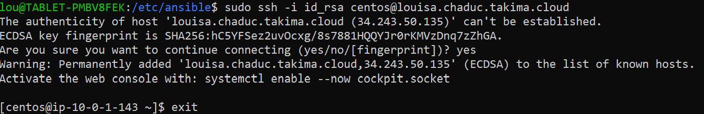

Savoir établir une connexion SSH distante c'est essentiellement ce que fait Ansible pour communiquer avec notre serveur. Et en plus Ansible nécessitera certaines configurations supplémentaires pour pouvoir accéder à votre machine.

`ansible all -m ping --private-key=id_rsa -u centos`  
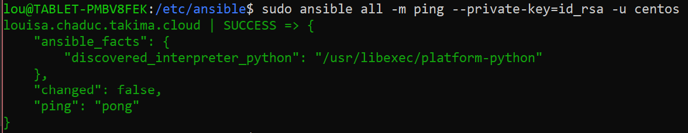

Demande à Ansible d'installer Apache pour faire un webserver : `ansible all -m yum -a "name=httpd state=present" --private-key=id_rsa -u centos --become`  
`--become` : Dit à Ansible de passer cette cmd en super user.  
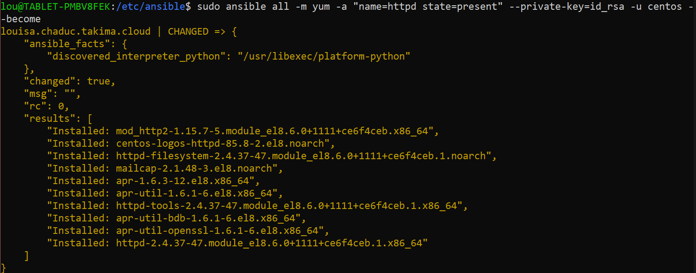

Création page HTML pour notre website : `ansible all -m shell -a 'echo "<html><h1>Hello Louisa</h1></html>" >> /var/www/html/index.html' --private-key=id_rsa -u centos --become`  
Démarrage du service Apache : `ansible all -m service -a "name=httpd state=started" --private-key=id_rsa -u centos --become`

<div style="border:1px solid grey; box-shadow: rgba(100, 100, 111, 0.2) 0px 7px 29px 0px; width: 250px; border-radius: 5px">

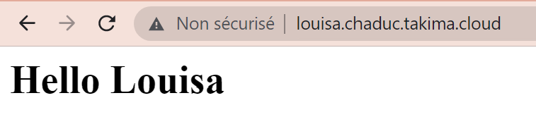

</div>

# TP3 - ANSIBLE

**Objectif :** Installez et déployez une application automatiquement avec ansible.

## INVENTORY

**Question 3-1 : Documentation de notre inventory des des commandes de base**

### Premier inventaire

Création de mon premier inventaire - `setup.yml` :

```
all:
  vars:
    ansible_user: centos
    ansible_ssh_private_key_file: /etc/ansible/id_rsa
  children:
    prod:
      hosts: louisa.chaduc.takima.cloud
```

Test de l'inventaire : `ansible all -i inventories/setup.yml -m ping`

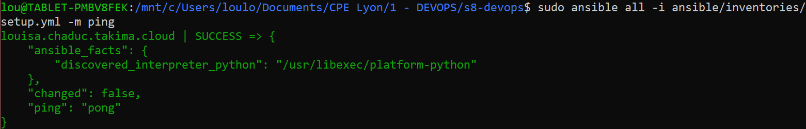

### Facts

**Les facts :** Ce sont des variables contenant des informations sur l'hôte. Il sont préfixés pas `ansible_` et représentent des informations dérivées des conversations avec les systèmes distants.

Obtenir la distribution de son OS : `ansible all -i inventories/setup.yml -m setup -a "filter=ansible_distribution*"`  
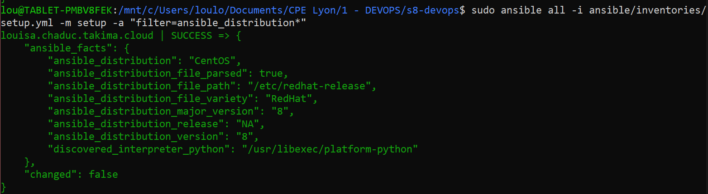

Retirer Apache : `ansible all -i inventories/setup.yml -m yum -a "name=httpd state=absent" --become`
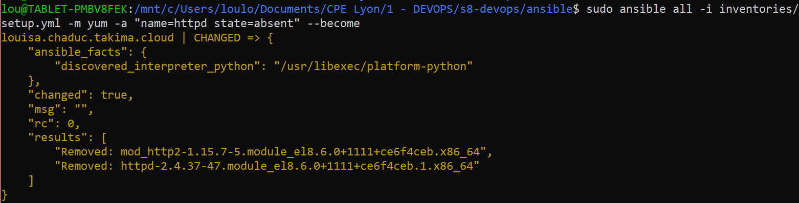

Réexécution de la commande :
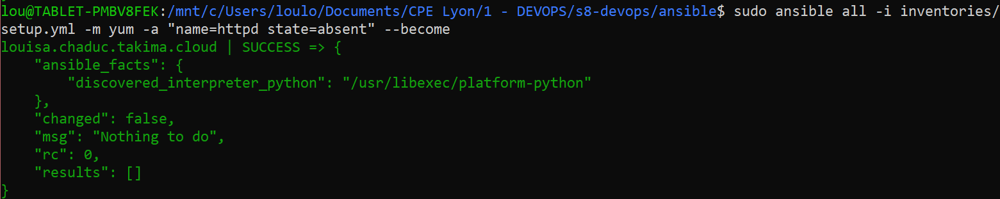

## PLAYBOOKS

**Question 3-2 : Documentation du playbook**

### Premier Playbook

Création de mon premier inventaire - `playbook.yml` :

```

```

Exécution du playbook : `ansible-playbook -i inventories/setup.yml first.playbook.yml`  
`--syntax-check` : Préfixe à ajouter pour tester les playbook avant des les exécuter.

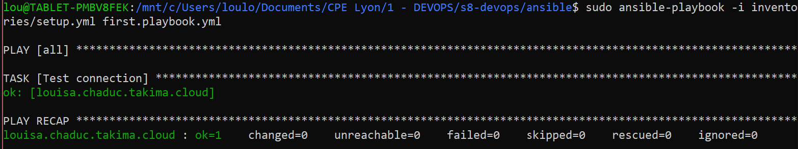

### Playbook avancé

Ce playbook nous servira à installer Docker sur notre serveur.

TODO: Documenter le playbook Docker

`ansible-playbook -i inventories/setup.yml docker.playbook.yml`
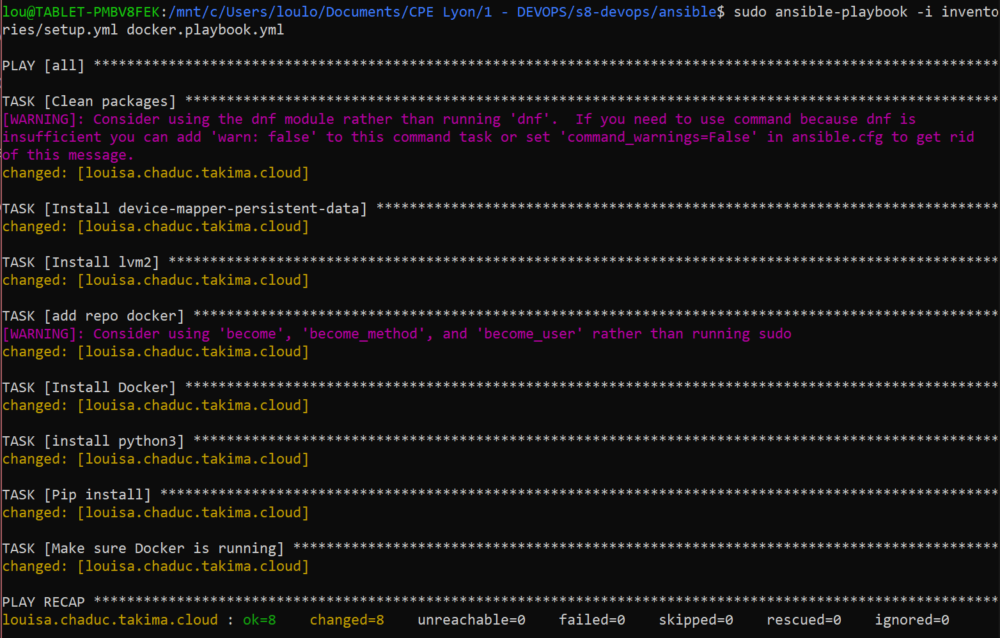

Vérifier qu'une task a bien été créée avec une commande ad-hoc ou en se connectant au serveur.

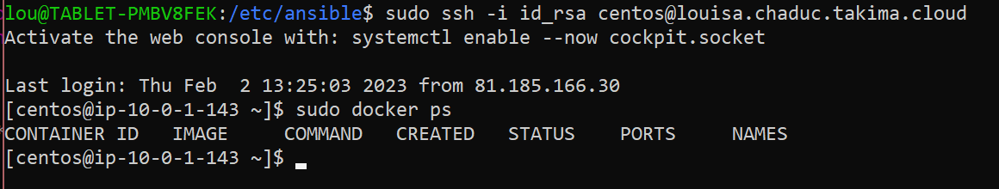

### Utiliser des rôles

Installation des roles docker : `ansible-galaxy init roles/docker`
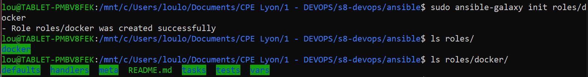

On déplace notre playbook docker dans le role, et on appelle simplement le role depuis le playbook. Cette séparation des roles nous permet de ne pas avoir des playbook d'un trop grande longueur.

`/ansible/roles/docker/tasks/main.yml`

```yaml
- name: Clean packages
  command:
    cmd: dnf clean -y packages

- name: Install device-mapper-persistent-data
  dnf: ...
```

`/ansible/main.playbook.yml`

```yaml
- hosts: all
  gather_facts: false
  become: yes
  roles:
    - docker
```

Quand on relance la commande du playbook, le résultat est le même que tout à l'heure. Mais les fichiers sont mieux découpés et plus évolutifs maintenant.

## DEPLOYEMENT

Je crée les rôles suivants :

- **NETWORK** : Gère la création du réseau Docker
  `ansible-galaxy init roles/network`

```yaml
# /tasks/main.yml
- name: "Create a network"
  docker_network:
    name: "{{ docker_network }}"

# /vars/main.yml
docker_network: app-network
```

Notre réseau a bien été crée :
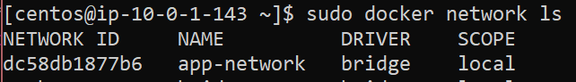

- **DATABASE** : Gère le container de base de données.  
  `ansible-galaxy init roles/database`  
  Pour chaque container il faut ajouter le réseau paramètre `networks` et j'ai choisi de mettre la valeur du nom du réseau dans une variable. En particuler pour ce container, il faut également ajouter un paramètre pour la variable d'environnement du mot de passe Postgre, pour cela on utilise le paramètre `env`.

```yaml
# /tasks/main.yml
- name: Run DATABASE
  docker_container:
    name: database
    image: youreastonefox/tp3-database:latest
    env:
      POSTGRES_PASSWORD: "{{postgres_pwd}}"
    networks:
      - name: "{{ docker_network }}"

# /vars/main.yml
docker_network: app-network
posgres_pwd: pwd
```

- **API**: Gère le container du backend.  
  `ansible-galaxy init roles/api`

```yaml
# /tasks/main.yml
- name: Run API
  docker_container:
    name: api
    image: youreastonefox/tp3-api:latest
    networks:
      - name: "{{ docker_network }}"

# /vars/main.yml
docker_network: app-network
```

- **HTTPD**: Gère le container du Proxy.  
  `ansible-galaxy init roles/httdp`  
  Avec le paramètre `ports` on ouvre les ports 80:80 du serveur HTTPD.

```yaml
# /tasks/main.yml
- name: Run HTTPD
  docker_container:
    name: httpd
    image: youreastonefox/tp3-httpd:latest
    ports:
      - "80:80"
    networks:
      - name: "{{ docker_network }}"

# /vars/main.yml
docker_network: app-network
```

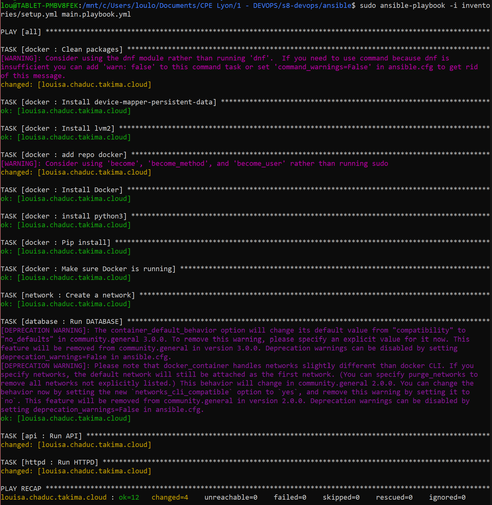
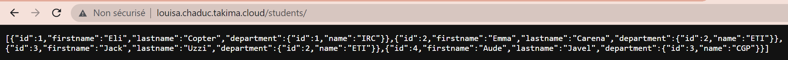

## FRONT
